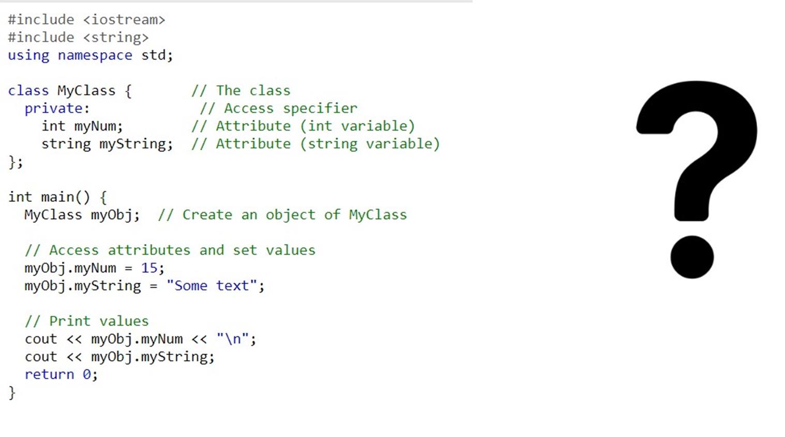

Errors:
1.Access Specifier: The class members myNum and myString should be public so they can be accessed outside the class.
2.Printing the String: The cout statement for myString is missing the newline character \n.