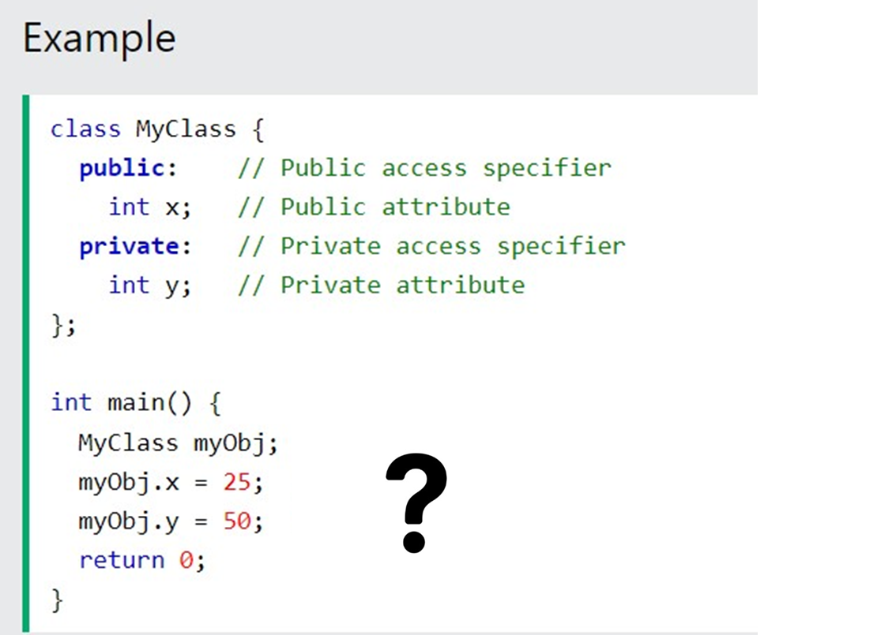

Errors:
1.Access Specifier: The member variables x and y are private, which means they cannot be accessed directly outside the class.
2.Printing the String: The cout statement for myString is missing the newline character \n.