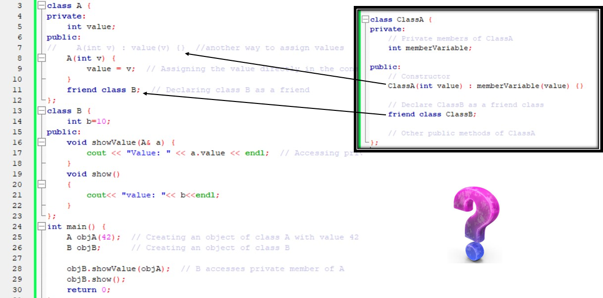

Errors:
1.Access Specifier: The member variable value in Class A is private, which means it cannot be accessed directly outside the class.
2.Friend Class: The friend class B should be able to access the private members of Class A.